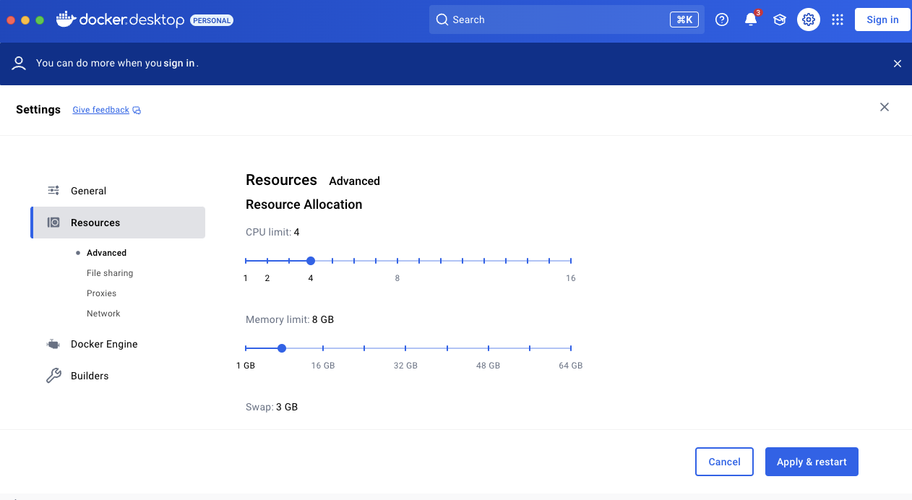

# Solo

[](https://www.npmjs.com/package/@hashgraph/solo)
[](LICENSE)

[](https://github.com/hashgraph/solo/actions/workflows/flow-build-application.yaml)
[](https://app.codacy.com/gh/hashgraph/solo/dashboard?utm_source=gh\&utm_medium=referral\&utm_content=\&utm_campaign=Badge_grade)
[](https://codecov.io/gh/hashgraph/solo)

An opinionated CLI tool to deploy and manage standalone test networks.

## Requirements

| Solo Version | Node.js                   | Kind       | Solo Chart | Hedera               | Kubernetes | Kubectl    | Helm    | k9s        | Docker Resources        |
|--------------|---------------------------|------------|------------|----------------------|------------|------------|---------|------------|-------------------------|
| 0.29.0       | >= 20.14.0 (lts/hydrogen) | >= v1.29.1 | v0.30.0    | v0.53.0 – <= v0.57.0 | >= v1.27.3 | >= v1.27.3 | v3.14.2 | >= v0.27.4 | Memory >= 8GB, CPU >= 4 |
| 0.30.0       | >= 20.14.0 (lts/hydrogen) | >= v1.29.1 | v0.30.0    | v0.54.0 – <= v0.57.0 | >= v1.27.3 | >= v1.27.3 | v3.14.2 | >= v0.27.4 | Memory >= 8GB, CPU >= 4 |
| 0.31.4       | >= 20.18.0 (lts/iron)     | >= v1.29.1 | v0.31.4    | v0.54.0 – <= v0.57.0 | >= v1.27.3 | >= v1.27.3 | v3.14.2 | >= v0.27.4 | Memory >= 8GB, CPU >= 4 |
| 0.32.0       | >= 20.18.0 (lts/iron)     | >= v1.29.1 | v0.38.2    | v0.58.1 - <= v0.59.0 | >= v1.27.3 | >= v1.27.3 | v3.14.2 | >= v0.27.4 | Memory >= 8GB, CPU >= 4 |
| 0.33.0       | >= 20.18.0 (lts/iron)     | >= v1.29.1 | v0.38.2    | v0.58.1 - <= v0.59.0 | >= v1.27.3 | >= v1.27.3 | v3.14.2 | >= v0.27.4 | Memory >= 8GB, CPU >= 4 |
| 0.34.0       | >= 20.18.0 (lts/iron)     | >= v1.29.1 | v0.42.10   | v0.58.1+             | >= v1.27.3 | >= v1.27.3 | v3.14.2 | >= v0.27.4 | Memory >= 8GB, CPU >= 4 |
| 0.35.0       | >= 20.18.0 (lts/iron)     | >= v1.29.1 | v0.44.0    | v0.58.1+             | >= v1.27.3 | >= v1.27.3 | v3.14.2 | >= v0.27.4 | Memory >= 8GB, CPU >= 4 |

### Hardware Requirements

To run a three-node network, you will need to set up Docker Desktop with at least 8GB of memory and 4 CPUs.



## Setup

* Install [Node](https://nodejs.org/en/download). You may also use [nvm](https://github.com/nvm-sh/nvm) to manage different Node versions locally, some examples:

```
# install specific nodejs version
# nvm install <version>

# install nodejs version 20.18.0
nvm install v20.18.0

# lists available node versions already installed
nvm ls

# swith to selected node version
# nvm use <version>
nvm use v20.18.0

```

* Useful tools:
  * Install [kubectl](https://kubernetes.io/docs/tasks/tools/)
  * Install [k9s](https://k9scli.io/)

## Install Solo

* Run `npm install -g @hashgraph/solo`

## Documentation

[Getting Started](https://hashgraph.github.io/solo/User/StepByStepGuide/)

## Support

If you have a question on how to use the product, please see our [support guide](https://github.com/hashgraph/.github/blob/main/SUPPORT.md).

## Contributing

Contributions are welcome. Please see the [contributing guide](https://github.com/hashgraph/.github/blob/main/CONTRIBUTING.md) to see how you can get involved.

## Code of Conduct

This project is governed by the [Contributor Covenant Code of Conduct](https://github.com/hashgraph/.github/blob/main/CODE_OF_CONDUCT.md). By participating, you are
expected to uphold this code of conduct.

## License

[Apache License 2.0](https://www.apache.org/licenses/LICENSE-2.0)
