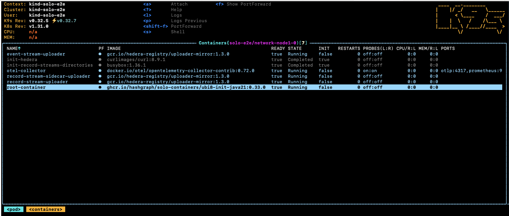
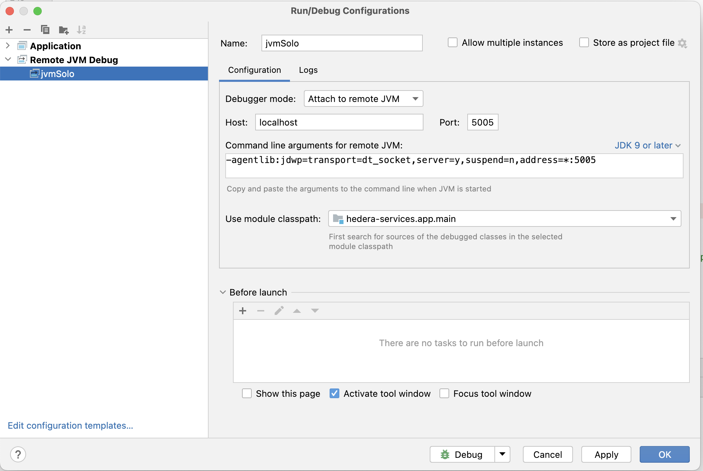
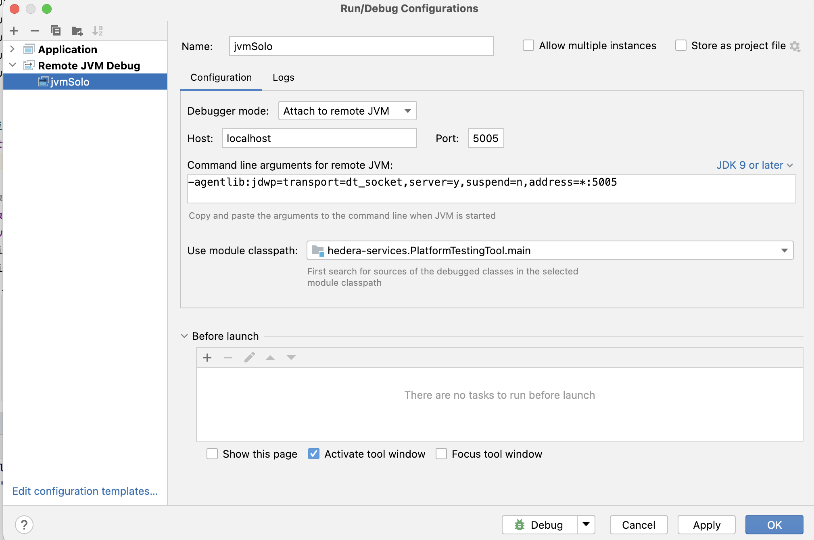
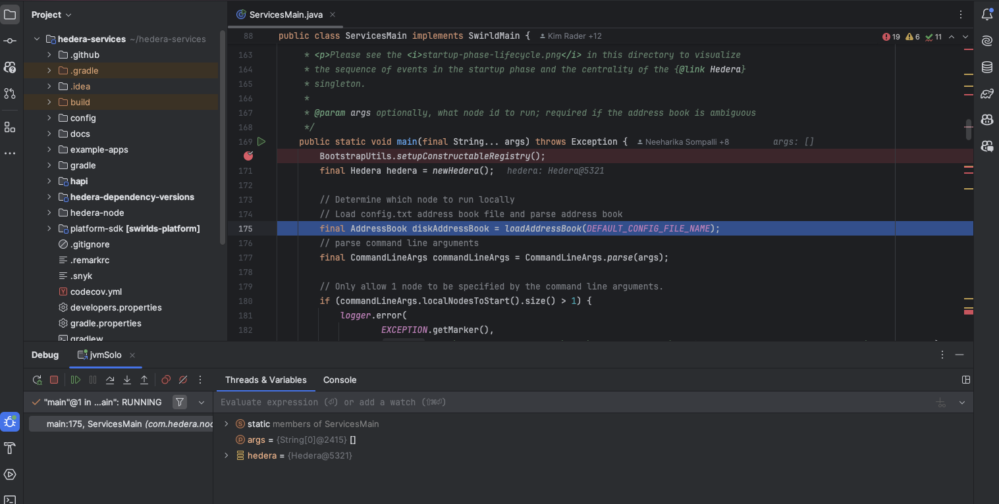
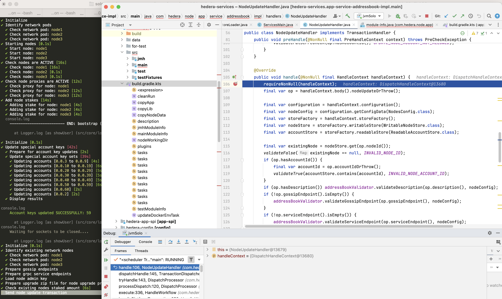

## How to debug Hedera Services and Platform SDK

> **⚠️ Warning**
> This document is out of date for the current release.  See [Step-by-step Guide](../StepByStepGuide.md) for the updated base commands to run that can be augmented with the extra flags and values provided in this guide. Hedera services and Platform SDK have moved to hiero-consensus-node repo <https://github.com/hiero-ledger/hiero-consensus-node>

### 1. Using k9s to access running network nodes logs

Running the command `k9s -A` in terminal, and select one of the network nodes:


Next, select the `root-container` and press the key `s` to enter the shell of the container.



Once inside the shell, you can change to directory `cd /opt/hgcapp/services-hedera/HapiApp2.0/`
to view all hedera related logs and properties files.

```bash
[root@network-node1-0 hgcapp]# cd /opt/hgcapp/services-hedera/HapiApp2.0/
[root@network-node1-0 HapiApp2.0]# pwd
/opt/hgcapp/services-hedera/HapiApp2.0
[root@network-node1-0 HapiApp2.0]# ls -ltr data/config/
total 0
lrwxrwxrwx 1 root root 27 Dec  4 02:05 bootstrap.properties -> ..data/bootstrap.properties
lrwxrwxrwx 1 root root 29 Dec  4 02:05 application.properties -> ..data/application.properties
lrwxrwxrwx 1 root root 32 Dec  4 02:05 api-permission.properties -> ..data/api-permission.properties
[root@network-node1-0 HapiApp2.0]# ls -ltr output/
total 1148
-rw-r--r-- 1 hedera hedera       0 Dec  4 02:06 hgcaa.log
-rw-r--r-- 1 hedera hedera       0 Dec  4 02:06 queries.log
drwxr-xr-x 2 hedera hedera    4096 Dec  4 02:06 transaction-state
drwxr-xr-x 2 hedera hedera    4096 Dec  4 02:06 state
-rw-r--r-- 1 hedera hedera     190 Dec  4 02:06 swirlds-vmap.log
drwxr-xr-x 2 hedera hedera    4096 Dec  4 16:01 swirlds-hashstream
-rw-r--r-- 1 hedera hedera 1151446 Dec  4 16:07 swirlds.log
```

Alternatively, you can use the following command to download hgcaa.log and
swirlds.log for further analysis.

```bash
# download logs as zip file from node1 and save in default ~/.solo/logs/solo-e2e/<timestamp/
solo node logs -i node1 -n solo-e2e
```

### 2. Using IntelliJ remote debug with Solo

NOTE: the hedera-services path referenced '../hedera-services/hedera-node/data' may
need to be updated based on what directory you are currently in.  This also assumes that you have done an assemble/build and the directory contents are up-to-date.

Setup a Intellij run/debug configuration for remote JVM Debug as shown in the below screenshot:



If you are working on platform testing application, you should use the following configuration
in intellij:



Setup breakpoint if necessary.

From solo repo directory, run the following command from terminal to launch a three node network, assume we are trying to attach debug to `node2` .
Make sure the path following `local-build-path` points to the correct directory.

Example 1: attach jvm debugger to a hedera node

```bash
./test/e2e/setup-e2e.sh
solo node keys --gossip-keys --tls-keys -i node1,node2,node3
solo network deploy -i node1,node2,node3 --debug-node-alias node2 -n "${SOLO_NAMESPACE}"
solo node setup -i node1,node2,node3 --local-build-path ../hedera-services/hedera-node/data -n "${SOLO_NAMESPACE}"
solo node start -i node1,node2,node3 --debug-node-alias node2 -n "${SOLO_NAMESPACE}"
```

Once you see the following message, you can launch jvm debugger from Intellij

```
❯ Check all nodes are ACTIVE
  Check node: node1,
  Check node: node2,  Please attach JVM debugger now.
  Check node: node3,
```

The Hedera Application should stop at the breakpoint you set:




Example 2: attach jvm debugger with node add operation

```bash
./test/e2e/setup-e2e.sh
solo node keys --gossip-keys --tls-keys -i node1,node2,node3
solo network deploy -i node1,node2,node3 --pvcs -n "${SOLO_NAMESPACE}"
solo node setup -i node1,node2,node3 --local-build-path ../hedera-services/hedera-node/data -n "${SOLO_NAMESPACE}"
solo node start -i node1,node2,node3 -n "${SOLO_NAMESPACE}"
solo node add --gossip-keys --tls-keys --debug-node-alias node4 --local-build-path ../hedera-services/hedera-node/data -n "${SOLO_NAMESPACE}" --pvcs true
```

Example 3: attach jvm debugger with node update operation

```bash
./test/e2e/setup-e2e.sh
solo node keys --gossip-keys --tls-keys -i node1,node2,node3
solo network deploy -i node1,node2,node3 -n "${SOLO_NAMESPACE}"
solo node setup -i node1,node2,node3 --local-build-path ../hedera-services/hedera-node/data -n "${SOLO_NAMESPACE}"
solo node start -i node1,node2,node3 -n "${SOLO_NAMESPACE}"
solo node update --node-alias node2  --debug-node-alias node2 --local-build-path ../hedera-services/hedera-node/data --new-account-number 0.0.7 --gossip-public-key ./s-public-node2.pem --gossip-private-key ./s-private-node2.pem  -n "${SOLO_NAMESPACE}"
```

Example 4: attach jvm debugger with node delete operation

```bash
./test/e2e/setup-e2e.sh
solo node keys --gossip-keys --tls-keys -i node1,node2,node3
solo network deploy -i node1,node2,node3,node4 -n "${SOLO_NAMESPACE}"
solo node setup -i node1,node2,node3,node4 --local-build-path ../hedera-services/hedera-node/data -n "${SOLO_NAMESPACE}"
solo node start -i node1,node2,node3,node4 -n "${SOLO_NAMESPACE}"
solo node delete --node-alias node2  --debug-node-alias node3 -n "${SOLO_NAMESPACE}"
```

### 3. Save and reuse network state files

With the following command you can save the network state to a file.

```bash
# must stop hedera node operation first
solo node stop -i node1,node2 -n solo-e2e

# download state file to default location at ~/.solo/logs/<namespace>
solo node states -i node1,node2 -n solo-e2e
```

By default, the state files are saved under `~/solo` directory

```bash
└── logs
    ├── solo-e2e
    │   ├── network-node1-0-state.zip
    │   └── network-node2-0-state.zip
    └── solo.log
```

Later, user can use the following command to upload the state files to the network and restart hedera nodes.

```bash
./test/e2e/setup-e2e.sh
solo node keys --gossip-keys --tls-keys -i node1,node2,node3
solo network deploy -i node1,node2,node3 -n "${SOLO_NAMESPACE}"
solo node setup -i node1,node2,node3 --local-build-path ../hedera-services/hedera-node/data -n "${SOLO_NAMESPACE}"

# start network with pre-existing state files
solo node start -i node1,node2 -n solo-e2e --state-file network-node1-0-state.zip
```
