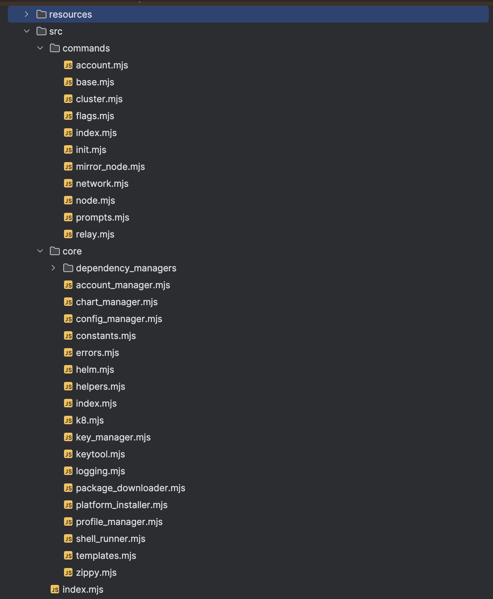

# Solo - Onboarding Questions

### What is solo and it's goal?

`solo` is an opinionated tool to empower developers to deploy production like Hedera networks, for testing, in a local or remote Kubernetes cluster.

Such a “`solo` deployed” Hedera network can be leveraged to perform any testing that otherwise would not be possible or cost-effective to do on production networks like Testnet or Mainnet. Swirldslabs is planning to use `solo` to deploy huge numbers of test networks on-demand using `solo` for internal testing and release process improvement. We anticipate `solo` can also empower external entities to do the same.

It is also easy to tear-down and create a new network on-demand using `solo` as it leverages kubernetes cluster. For a long running network deployment, `solo` can also be used to add new nodes and refresh existing nodes with new/previous software versions. Note that here “node refresh” operation is not node ‘upgrade’ (more on ‘upgrade’ later)

`solo` will soon enable node upgrade process similar to Mainnet/Testnet with the help of `solo-operator` which is a custom kubernetes operator running inside the cluster to support various functionalities. `solo-operator` is still under development and is not ready yet. We anticipate the first release of `solo-operator` in Q3 2024.

### Overview of the architecture of conceptual code components. Highlight separation of concerns and what each component is responsible for and how they work together. What technologies are utilized.

`solo` is built using pure Javascript (ES6).

It leverages existing Helm Charts to deploy various components such as hedera-mirror-node, hedera-json-rpc-relay, MinIO, full-stack-testing etc.

`solo` downloads a `helm` binary during init that is executed to deploy/destroy a Helm chart in the cluster. It also uses Kubernetes API and a client library to interact with the pods in the cluster.

`solo` also leverages crypto libraries to generate keys for nodes if required (although for production or more sensitive use-cases, it is encouraged to generate keys using `openssl` or other well known key generation tools).

`solo` generates PEM formatted keys using a javascript library, whereas PFX formatted keys are generated using Java `keytool`. `solo` automatically pulls a copy of JRE to leverage `keytool` to generate PFX keys if user desires to generate PFX keys using `solo`.

At a high level, there are two main packages namely `commands` and `core` :

* `core`: contains various reusable classes
* `commands`: contains various command classes, command flags and prompts etc.

### Showcase an existing deployment and how to get up and running quickly to run solo. It would be good to confirm endpoints and ports and show an example of solo supporting a HAPI transaction, query to its Mirror Node and Relay endpoint and a working Mirror Node Explorer.

Check `Solo Workshop - 1` :

[(archive) Solo Workshop - 1 DevCon 2024 Spring (Local Kubernetes Cluster)](https://www.notion.so/archive-Solo-Workshop-1-DevCon-2024-Spring-Local-Kubernetes-Cluster-8818724b161a4d7a970f48b840952d71?pvs=21)

### Deep dive into code structure to give ideas of where changes need to be made as they come up and what knowledge is required.

<aside>
💡 Not sure what to add here. If there is any specific question, we can add some guidelines.

</aside>

I would recommend someone to setup a local dev environment, run e2e tests and then start debugging a test-case to understand the code paths.

In order for anyone to be able to amend existing functionalities or introduce new features, they need to have understanding of how Hedera network is deployed in production and what configuration files or parameters are usually required. Although that knowledge is not documented clearly anywhere in a comprehensive manner, exploring how solo deploys a network and configures a node can give enough details for someone to be able to understand the process and introduce new features as required.

Certainly, someone will need some working knowledge about Kubernetes cluster to be able to debug and inspect various components.

Since `solo` leverages existing Helm charts, it is reasonably easy to seek help from respective teams that are maintaining those Helm charts:

* https://github.com/hashgraph/full-stack-testing. (Release Engineering Team, @Nathan Klick)
* https://github.com/hashgraph/hedera-json-rpc-relay (Smart Contract Team, @Nana)
* https://github.com/hashgraph/hedera-mirror-node ( Mirror Node Team, @Steven Sheehy )

### Showcasing existing tests and how to run them.

Check: https://github.com/hashgraph/solo/blob/main/DEV.md

### What documentation exists and where does it live currently.

Our official docs site: https://hashgraph.github.io/solo/

### Where are we in the roadmap, what's been done, what's on deck and what's next?

* **What’s been done  (As of May 2024)**

  As of now a MVP is ready where `solo` can be used to deploy a test network, create accounts and use by developers for general testing of their application. Some core functionalities are as below:

  * Deploy/Destroy/Add/Refresh consensus node including proxies and uploaders (record-stream, event-stream etc.)
  * Create/Top-up/Update accounts
  * Deploy/Destroy mirror-node components including explorer
  * Deploy/Destroy one or more json-rpc-relays
  * Connect Telemetry (Grafana, Prometheus, Tempo etc.)
* **What’s on deck  (As of May 2024)**
  * Ensure relays can connect to mirror node and are usable by developers for dApp development
  * Allow `solo state` to be stored in the kubernetes cluster instead of storing on local machine
  * Introduce `solo state lock` to support multi-user support to manage a single deployment in a remote cluster
* **What’s next (As of May 2024)**
  * `solo`
    * Deterministic image support (This is necessary for `solo-operator` to support node upgrade process)
    * Support Hedera Network deployment across multiple clusters
  * `solo-operator`
    * Deploy a Hedera network using deterministic image (some business logic from `solo` will be moved into `solo-operator`). This is to avoid building docker images on the machine as done by NMT currently.
    * Upgrade an existing network (similar to the Mainnet upgrade protocol and process but without using NMT as it is done currently)
