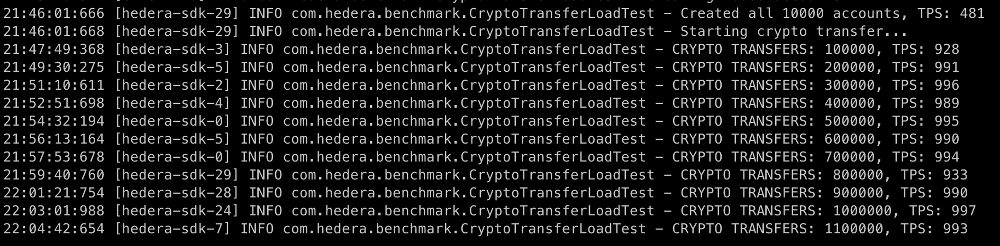
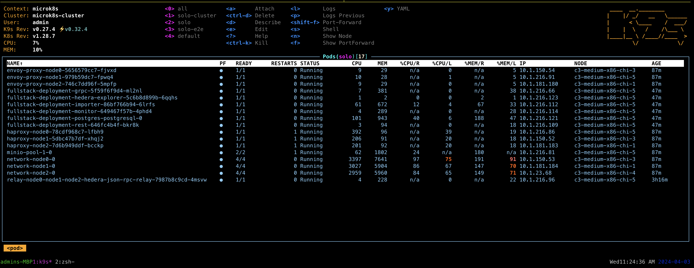
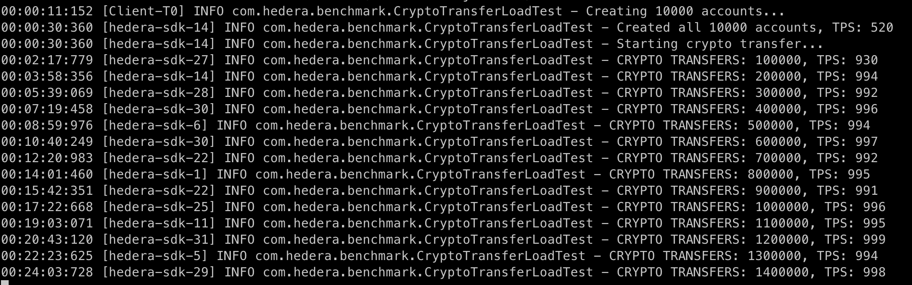

# Preconfigured Resource Profiles (DRAFT)

| Last Revision | Mar 20, 2024  |
|---------------|---------------|
| Solo Version  | TBD           |
| Contact       | @Lenin Mehedy |

# Background

`solo` needs to support deployment of preconfigured networks that allows users to achieve a desired
TPS. Without the preconfigured profiles, it is going to be difficult for end-users to identify the
optimal settings.

We are aiming to benchmark the settings on our internal Latitude clusters in the coming weeks and
confirm that the recommended profiles can achieve the desired TPS.

## Usage

A user could deploy three nodes with preconfigured `large` profile as below:

```shell
solo network deploy -i node0, node1, node2 --profile large
```

User would also be able to specify custom settings using a profile file (e.g. `custom-spec.yaml`) as
below

```shell
solo network deploy -i node0, node1, node2 --profile-file custom-spec.yaml --profile large
```

An example of `custom-spec.yaml` is in `solo` repository `/resources/profiles/custom-spec.yaml`:

## Hardware Profiles

We are going to deploy the following sets of hardware in our Latitude clusters.

| Hardware Profile | CPU     | RAM    |
|------------------|---------|--------|
| **LARGE**        | 48 vCPU | 256 GB |
| **MEDIUM**       | 24 vCPU | 128 GB |
| **SMALL**        | 12 vCPU | 32 GB  |
| **TINY**         | 4 vCPU  | 8 GB   |

## Resource Limits

We define the maximum resource limits for various components in the table below to achieve a desired
TPS.

<aside>
💡 1. Consensus node with 24vCPU, 64 GB RAM was found to be sufficient for ~10K TPS in our PoC. 
2. Same colored containers in the table below are deployed on the same HW (e.g. LARGE / MEDIUM / SMALL / TINY/ LOCAL). LOCAL profile is for local development where Docker Desktop should have 8 cores and 16 GB RAM.
3. Regular black colored containers in the table below are deployed on any HW

</aside>

| Deployment Component (Pod) | Containers               | Remarks                                                                                                    | LARGE<br>(10K ≤ TPS ≤ 12K)<br>\[~? TPS] | MEDIUM <br/>(3K ≤ TPS ≤ 8K)<br/> \[~? TPS] | SMALL <br/>(1K ≤ TPS ≤ 3K) <br/>\[~? TPS]                | TINY <br/>(TPS ≤ 1K) <br/>\[~990 TPS]                                      | LOCAL <br/>(TPS ≤ 1K) <br/>\[~950 TPS]                            |
|----------------------------|--------------------------|------------------------------------------------------------------------------------------------------------|-----------------------------------------|-------------------------------------------|---------------------------------------------------------|---------------------------------------------------------------------------|------------------------------------------------------------------|
| `consensus`                | `root`                   | Root container that runs Hashgraph services                                                                | 30 vCPU, 184 GB                         | 16 vCPU, 80 GB                            | limits: cpu: 11500m memory: 12000Mi                     | limits: cpu: 3750m memory: 7750Mi                                         | limits: cpu: 0 memory: 0                                         |
|                            | `recordStreamUploader`   | Sidecar                                                                                                    | 2 vCPU, 8 GB                            | 1 vCPU, 4 GB                              | limits: cpu: 500m memory: 1000Mi                        | limits: cpu: 250m memory: 200Mi                                           | limits: cpu: 0 memory: 0                                         |
|                            | `eventStreamUploader`    | Sidecar                                                                                                    | 2 vCPU, 8 GB                            | 1 vCPU, 4 GB                              | limits: cpu: 500m memory: 1000Mi                        | limits: cpu: 250m memory: 200Mi                                           | limits: cpu: 0 memory: 0                                         |
|                            | `accountBalanceUploader` | Sidecar                                                                                                    | 2 vCPU, 8 GB                            | 1 vCPU, 4 GB                              | limits: cpu: 500m memory: 1000Mi                        | limits: cpu: 250m memory: 200Mi                                           | limits: cpu: 0 memory: 0                                         |
|                            | `backupUploader`         | Sidecar                                                                                                    | 2 vCPU, 8 GB                            | 1 vCPU, 4 GB                              | limits: cpu: 500m memory: 1000Mi                        | limits: cpu: 250m memory: 200Mi                                           | limits: cpu: 0 memory: 0                                         |
|                            | `otelCollector`          | Sidecar                                                                                                    | 2 vCPU, 8 GB \*                          | 2 vCPU, 8 GB \*                            | limits: cpu: 500m memory: 1000Mi                        | limits: cpu: 250m memory: 200Mi                                           | limits: cpu: 0 memory: 0                                         |
| `rpcRelay`                 |                          |                                                                                                            | 4 vCPU, 8 GB \*                          | 2 vCPU, 8 GB \*                            | limits: cpu: 2000m memory: 4000Mi                       | limits: cpu: 1000m memory: 500Mi                                          | limits: cpu: 500m memory: 1000Mi                                 |
| `haproxy`                  |                          | Better to co-locate with consensus pod to reduce network latency.                                          | 4 vCPU, 8 GB \*                          | 2 vCPU, 8 GB \*                            | limits: cpu: 2000m memory: 4000Mi                       | limits: cpu: 1000m memory: 500Mi                                          | limits: cpu: 0 memory: 0                                         |
| `envoyProxy`               |                          | Better to co-locate with consensus pod to reduce network latency.                                          | 4 vCPU, 8 GB \*                          | 2 vCPU, 8 GB \*                            | limits: cpu: 2000m memory: 4000Mi                       | limits: cpu: 1000m memory: 500Mi                                          | limits: cpu: 0 memory: 0                                         |
| `explorer`                 |                          |                                                                                                            |                                         |                                           |                                                         |                                                                           | limits: cpu: 1000m memory: 1000Mi                                |
| `mirror`                   | `postgresql`             | Needs to be able to support high throughput.                                                               | 12 vCPU, 32 GB                          | 6 vCPU, 16 GB                             | limits: cpu: 3000m memory: 8000Mi                       | size: 100Gi limits: cpu: 1500m memory: 2000Mi                             | size: 10Gi limits: cpu: 1000m memory: 1000Mi                     |
|                            | `importer`               | Needs to be able to support high throughput. Better to co-locate with postgresql to reduce network latency | 4 vCPU, 16 GB                           | 3 vCPU, 8GB                               | limits: cpu: 3000m memory: 8000Mi                       | limits: cpu: 1500m memory: 2000Mi                                         | limits: cpu: 1000m memory: 2000Mi                                |
|                            | `rest`                   | Can be smaller machine                                                                                     | 2 vCPU, 8 GB                            | 1 vCPU, 4 GB                              | limits: cpu: 1000m memory: 4000Mi                       | limits: cpu: 1000m memory: 500Mi                                          | limits: cpu: 500m memory: 500Mi                                  |
|                            | `web3`                   | Can be smaller machine                                                                                     | 2 vCPU, 8 GB                            | 1 vCPU, 4 GB                              | limits: cpu: 1000m memory: 4000Mi                       | limits: cpu: 1000m memory: 500Mi                                          | limits: cpu: 500m memory: 500Mi                                  |
|                            | `grpc`                   | Can be smaller machine                                                                                     | 2 vCPU, 8 GB                            | 1 vCPU, 4 GB                              | limits: cpu: 1000m memory: 4000Mi                       | limits: cpu: 1000m memory: 500Mi                                          | limits: cpu: 500m memory: 1000Mi                                 |
|                            | `monitor`                | Can be smaller machine                                                                                     | 2 vCPU, 8 GB                            | 1 vCPU, 4 GB                              | limits: cpu: 1000m memory: 4000Mi                       | limits: cpu: 1000m memory: 500Mi                                          | limits: cpu: 500m memory: 1000Mi                                 |
| `minio`                    | `tenant`                 | Needs to be able to support high throughput                                                                | 12 vCPU, 32 GB <br/>Vol. size: 100 GB   | 8 vCPU, 16GB <br/>Vol. size: 40 GB        | limits: cpu: 2000m memory: 8000Mi <br/>Vol. size: 20 GB | limits: cpu: 1000m memory: 2000Mi <br/>volumePerServer: 1 <br/>size: 10Gi | limits: cpu: 0 memory: 0 <br/>volumePerServer: 1 <br/>size: 10Gi |

## Performance Metrics

We are going to rate these profiles based on the following transaction types that achieves the
specified TPS

* Phase - 1:  `Crypto Transfer` (Must achieve the desired TPS)
* Phase - 2: `HTS Transactions` ( Need to see what TPS we can achieve, should be close)
* Phase - 3: `NFT Transactions` ( Need to see what TPS we can achieve, should be close)

### Performance  with SMALL profile

### Performance with TINY profile (Consensus node resource limit: 4 vCPU, 8GB RAM)







# Appendix

## Pod Allocation Rules

For resiliency of the deployed network with hardware failures/limitations, we may adopt the
following allocation rules using taints/affinity:

* Same type of pod of the same deployment shouldn’t be placed in the same HW
  * e.g. consensus nodes in the same deployment should be placed in different HW
* Consensus node HW will not host other components other than proxies
* Proxies and its consensus node should be on the same HW to reduce network latency

## Pod Resource Profiles

| Pod Size | CPU          | RAM   | Supported on HW          |
|----------|--------------|-------|--------------------------|
| **XL3**  | 12 vCPU      | 32 GB | **MEDIUM**               |
| **XL2**  | 8 vCPU       | 16 GB | **SMALL**                |
| **XL1**  | 6 vCPU       | 16 GB | **SMALL**                |
| **L3**   | 4 vCPU       | 32 GB | **LARGE, MEDIUM**        |
| **L2**   | 4 vCPU       | 16 GB | **SMALL**                |
| **L1**   | 4 vCPU       | 8 GB  | **SMALL**                |
| **M3**   | 3 vCPU       | 8 GB  | **SMALL**                |
| **M2**   | 2 vCPU       | 8 GB  | **LARGE, MEDIUM, SMALL** |
| **M1**   | 2 vCPU       | 4 GB  | **SMALL, TINY**          |Ò
| **S3**   | 1 vCPU       | 8 GB  | **MEDIUM, SMALL**        |
| **S2**   | 1 vCPU       | 4 GB  | **MEDIUM, SMALL**        |
| **S1**   | 1 vCPU       | 2 GB  | **SMALL, TINY**          |
| **T1**   | **0.5 vCPU** | 1 GB  | **TINY**                 |

## Example: potential pod allocations on a Hardware

| Hardware Profile | CPU     | RAM    | Potential pod combinations                                                                                                                                                                                                                                                                         |
|------------------|---------|--------|----------------------------------------------------------------------------------------------------------------------------------------------------------------------------------------------------------------------------------------------------------------------------------------------------|
| **LARGE**        | 48 vCPU | 256 GB | 16 x (2 vCPU, 8 GB) + 4 x  (4 vCPU, 32 GB)                                                                                                                                                                                                                                                         |
| **MEDIUM**       | 24 vCPU | 128 GB | 4 x (4 vCPU, 16 GB) + 2 x (4 vCPU, 32 GB), 8 x (2 vCPU, 8 GB) + 2 x (4 vCPU, 32 GB), 16 x (1 vCPU, 4 GB) + 8 x (1 vCPU, 8 GB),                                                                                                                                                                     |
| **SMALL**        | 12 vCPU | 32 GB  | 4 x (3 vCPU, 8 GB), 2 x (6 vCPU, 16 GB), 2 x (2 vCPU, 8 GB) + 1 x (8 vCPU, 16 GB), 2 x (2 vCPU, 8 GB) + 2 x (4 vCPU, 8 GB), 4 x (1 vCPU, 4 GB) + 2 x (4 vCPU, 8 GB), 2 x (1 vCPU, 8 GB) + 2 x (2 vCPU, 8 GB), 8 x (1 vCPU, 2 GB) + 1 x (4 vCPU, 16 GB), 16 x (0.5 vCPU, 1 GB) + 2 x (2 vCPU, 8 GB) |
| **TINY**         | 4 vCPU  | 8 GB   | 4 x (1 vCPU, 2 GB), 2 x (2 vCPU, 4 GB), 8 x (0.5 vCPU, 1 GB)                                                                                                                                                                                                                                       |
