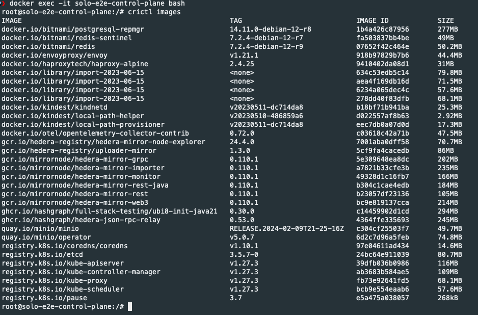
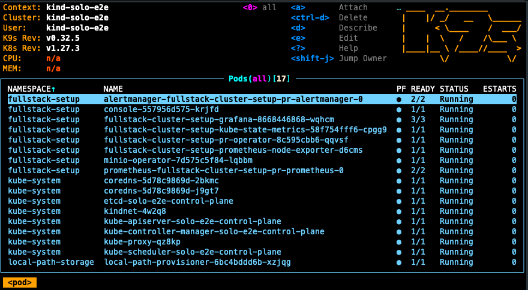
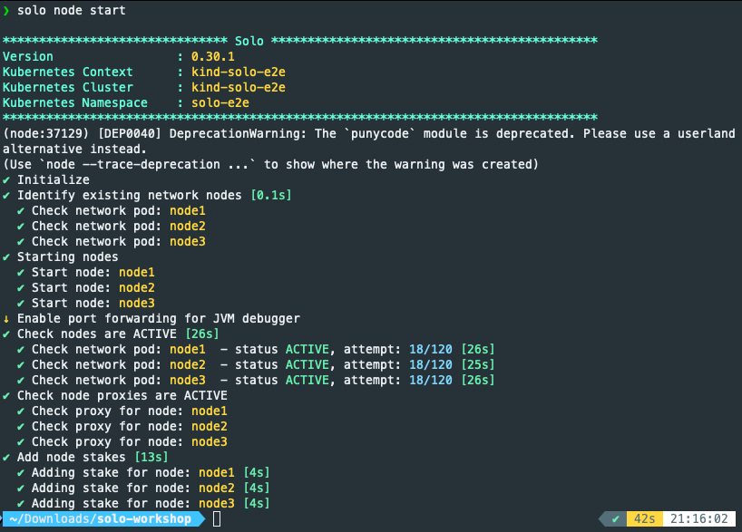
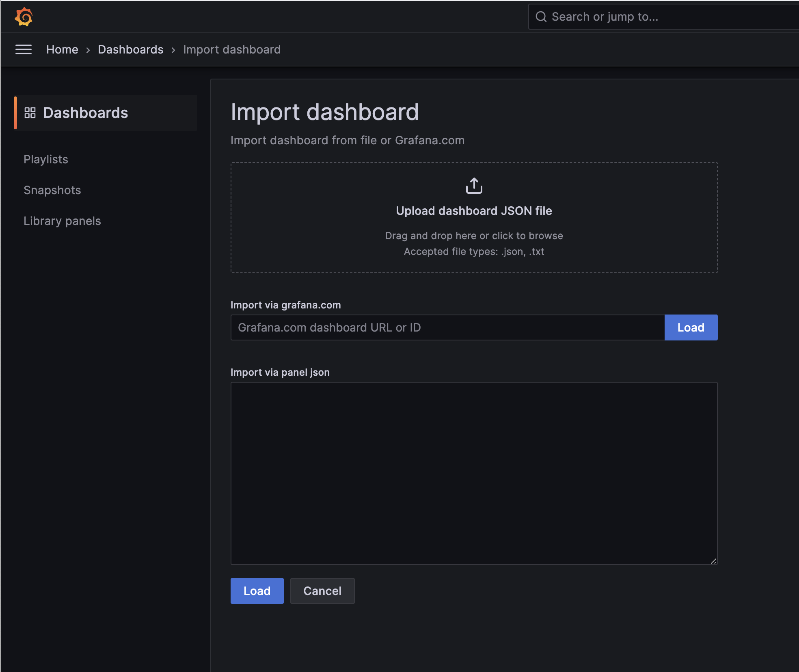
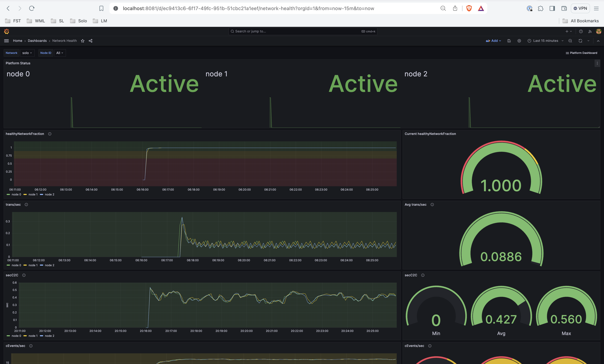
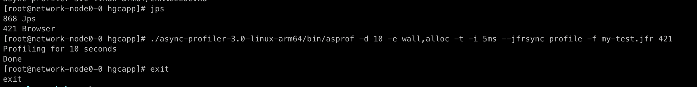
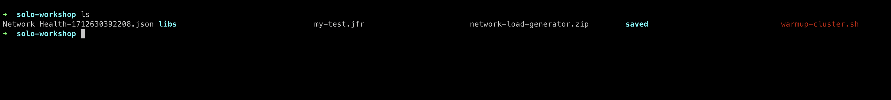

# Solo Workshop - DevCon 2024 Fall (Local Kubernetes Cluster with Debug)

# Objective

- Run a network (1~3 nodes) locally on the laptop using [**Solo**](https://github.com/hashgraph/solo)
- Option 1: Use v0.54.0-alpha.4
- Option 2: Use local Hedera build (develop?)
- Optional: deploy Mirror Node & Explorer
- Optional: deploy JSON RPC Relay

Demo: https://www.loom.com/share/46a0eadb13ef432b8efc8d4307031d4e?sid=79c04de3-c0f6-4858-b289-165b2d67cf08

# Rerunning without a full restart

NOTE: You can jump from option 1 to option 2 and vice versa, or you can redeploy a different local build by deleting the `solo-e2e` namespace (without deleting the cluster and without deleting fullstack-setup namespace).  In K9s use `:namespace` then select `solo-e2e` and enter on the keyboard `ctrl-d`, wait for it to terminate, then run

```bash
export SOLO_CLUSTER_NAME=solo-e2e;export SOLO_NAMESPACE=solo-e2e;export SOLO_CLUSTER_SETUP_NAMESPACE=fullstack-setup
kubectl delete namespace ${SOLO_NAMESPACE}
solo init -n $SOLO_NAMESPACE -i node1,node2,node3 -s "${SOLO_CLUSTER_SETUP_NAMESPACE}"
```

then, you can jump to section 3 with the `solo network deploy...` steps.

NOTE: if you continuously are having issues, delete the cluster and start over:

```bash
kind delete cluster -n solo-e2e
```

# How To Deploy a Hedera Network In A Local kubernetes Cluster

**Required Time: ~60 mins**

### Prerequisites: [Solo Workshop - Prerequisites (MacOS)](https://www.notion.so/Solo-Workshop-Prerequisites-MacOS-311aa63815de4f16bfb950441eb2b6f3?pvs=21)

---

## 1. Create local kubernetes cluster

<aside>
💡 You need at least 8 cores and 16GB RAM allocated to Docker for 3 consensus nodes and all other components (mirror-node, relays , proxies etc.). So if you can allocate more CPU and Memory that’s even better. Feel free to update resources to your Docker Desktop (10 CPU, 32 GB) now.

If you cannot allocate that much then, please try to deploy one consensus node (in step 3.6 use `-i node0`)

</aside>

### 1.1 Setup env variables and terminals

Open a terminal and go into your `solo-workshop` directory. You’ll need two terminals, so it might be better to split your current terminal or put two terminals side-by-side.

Setup some env variables like below.

```bash
export SOLO_CLUSTER_NAME=solo-e2e;export SOLO_NAMESPACE=solo-e2e;export SOLO_CLUSTER_SETUP_NAMESPACE=fullstack-setup
```

#### Checkpoint

Also split your terminals like below so that you can run commands on one terminal and watch results in the other terminal where you will run k9s (in upcoming step)

If you don’t know how to split your terminal, just open two separate windows and put side-by-side (fyi, I am using tmux so it may look a bit different to some of you).


### 1.2 Create a k8s cluster

Run the command below in your terminal.

```bash
kind create cluster -n "${SOLO_CLUSTER_NAME}"
```

#### Checkpoint


### 1.3 Load images into the cluster

Go to your `solo-workshop` directory that you created during prerequisite setup and run the command below.

This step is only required during this workshop so that we don’t create network congestion in the Hotel’s WiFi Network. During normal use of `solo`, you don’t need to do this.  Every time you delete your Kind cluster, you will need to do this again, else it will download the images from the internet instead of what is cached in Docker.  Every time you delete your Kind cluster, then you will need to do this command again if you have a low internet bandwidth connection (or no internet connection).

```bash
 source warmup-cluster.sh; load_images
```

#### Checkpoint


**Optional:** You may also check using Docker Engine if the images are loaded or not in your cluster. You will need to run `crictl images` once you exec inside `solo-e2e-control-plane` as shown below.

```bash
docker exec -it solo-e2e-control-plane bash
crictl images

```



### 1.4 View k8s cluster using `k9s`

***** In a the second terminal (or window), run the following command to check your k8s cluster**..***

```bash
k9s -A
```

As you run various `solo` commands in the upcoming steps you will be able to watch different components being deployed in the cluster on this k9s terminal.

#### Checkpoint

If you only see a list of namespaces, then just select the namespace ‘all’ and press enter.


---

## 2. Install Solo And Setup Cluster Resources

### 2.1 Install

Use `npm` to install `solo`.  This command only needs to be done one time, after that you are good.

```bash
npm i -g @hashgraph/solo
```

#### Checkpoint

Verify `solo` is installed (ensure version is ≥  `0.30.1`)


### 2.2 Run Solo Init

Here we specify the node IDs using `-i` switch. If you need to run a single node, just enter a single node ID as `-i node0` .  Make sure to run this in the terminal that you did the variable exports in.

```bash
rm -rf ~/.solo
solo init -n $SOLO_NAMESPACE -i node1,node2,node3 -s "${SOLO_CLUSTER_SETUP_NAMESPACE}"
```

#### Checkpoint


### 2.3 Generate node keys

You need to create the gossip and TLS keys for your network nodes.

```bash
solo node keys --gossip-keys --tls-keys
```

#### Checkpoint


Ensure you can view the keys generated:

```bash
ls -1  ~/.solo/cache/keys
```


### 2.4 Deploy shared network components

You need to deploy the shared component once per cluster.

Afterwards, you will be able to deploy as many Hedera Network as you need in different namespaces.

```bash
solo cluster setup --prometheus-stack
```

#### Checkpoint


Watch your `k9s` terminal and ensure status of all pods are `Running` as below in namespace called `fullstack-setup` (may take ~4 mins depending on the network speed):



---

## 3. Run Hedera Platform and Services Assemble

### 3.1 (Option 2) Run Gradle Assemble

```bash
# cd into the root folder of your local copy of the hashgraph/hedera-services repo
# e.g.: cd /Users/user/source/hedera-services
# NOTE: if you haven't completed the pre-req steps or pulled the develop branch recently you may take a while to 
#       download during the workshop
pwd
ls -1
# leaving out steps for: git checkout develop; git pull (see pre-req page and steps)
./gradlew assemble

```

#### Checkpoint

```bash
# cd into the root folder of your local copy of the hashgraph/hedera-services repo
# e.g.: cd /Users/user/source/hedera-services
# 
❯ pwd
/Users/user/source/hedera-services
❯ ls -1
LICENSE
README.md
block-node
build
codecov.yml
config
docs
example-apps
gradle
gradle.properties
gradlew
gradlew.bat
hapi
hedera-dependency-versions
hedera-node
platform-sdk
settings.gradle.kts
version.txt
❯ ./gradlew assemble
...
❯ ls -1 ../hedera-services/hedera-node/data
apps
config
keys
lib
onboard
```


### 3.2 Deploy Network Nodes

```bash
# pvcs (Persistent Volume Claims are needed to do the Node Add to retain data when pods are brought down)
solo network deploy --pvcs --prometheus-svc-monitor
```

#### Checkpoint


in K9s type: `:pvc` and hit enter to see the pvcs setup:


In k9s type: `:pods` to switch back to the pods screen

### 3.3a (Option 1) Setup consensus nodes with platform version

```bash
solo node setup
```

#### Checkpoint


### 3.3b (Option 2) Setup consensus nodes with local Hedera build

```bash
# make sure your build path is relative or fully qualified where `hedera-services` is pointing to the root 
# directory of the folder containing your hashgraph/hedera-services repo
solo node setup --local-build-path ../hedera-services/hedera-node/data
```

#### Checkpoint


### 3.4. Start Hedera consensus nodes

```bash
solo node start
```

#### Checkpoint




### 3.5 Deploy mirror node components

```bash
solo mirror-node deploy
```

#### Checkpoint


Watch your `k9s` terminal and ensure status of all pods (with prefix `fullstack-deployment-`) are `Running` as below (may take ~6 mins depending on the network speed):


### 3.6 Deploy a single relay

Here we are deploying a single relay pointing to all three nodes. If needed you may deploy more relays by specifying the node IDs using the `-i` switch, but for this workshop demo purpose just one is enough.

```bash
solo relay deploy -i node1,node2,node3
```

#### Checkpoint


Watch your `k9s` terminal and ensure status of relay pod (with prefix `relay-node0-node1-node2-hedera-json-rpc-relay-`) is `Running` as below (may take ~4 mins depending on the network speed):


### 3.7 Verify Hedera Network Is Provisioned

Check your other terminal where you ran `k9s` command and you will be see a set of pods are running like below in your namespace `solo`:


---

## 4. View Hedera Explorer

### 4.1 Expose Hedera Explorer port

```bash
kubectl port-forward svc/fullstack-deployment-hedera-explorer -n $SOLO_NAMESPACE 8080:80 &
```

#### Checkpoint


Visit: http://localhost:8080/

NOTE: click Transactions and then Dashboards and the URL will update from mainnet to localnet


### 4.2 Create some transaction data to view in Hedera Explorer

```bash
solo account create
solo account create
```

#### Checkpoint


View Hedera Explorer in your browser and click transactions: http://localhost:8080/localnet/transactions


## 5. Add a Network Node

### 5.1 (Option 1) Run Solo Node Add

```bash
solo node add --gossip-keys --tls-keys
```

#### Checkpoint


### 5.2 (Option 2) Setup Remote JVM Debug

Open IntelliJ Ultimate, Menu > Run > Edit Configurations > + “Add a new configuration” > Remote JVM Debug

```bash
Solo-Network-JVM
localhost
5005
-agentlib:jdwp=transport=dt_socket,server=y,suspend=n,address=*:5005
```


#### Checkpoint

Here the breakpoint is set.


### 5.3 (Option 2) Set a Breakpoint

In IntelliJ Ultimate set a breakpoint, example `java/com/hedera/node/app/ServicesMain.java`


### 5.4 (Option 2) Run Solo Node Add with Debugger Attached

```bash
solo node add --debug-nodeid node4 --gossip-keys --tls-keys
```

When you see the message `Please attach JVM debugger now`


Go to IntelliJ and Debug with your Solo-Network-JVM configuration


#### Checkpoint

IntelliJ should attach the debugger and hit the breakpoint and pause, once you are complete with everything, disable all breakpoints and resume so that Solo can finish the remaining steps


## 6. Setup Performance Metrics Dashboard

### 6.1 Click and download Grafana Dashboard file

Download the attached **Grafana Dashboard configuration file** (below) into `solo-workshop` directory (by placing a cursor on the filename below to highlight, then click the three dots on the right of the file name and then select `Download`)

[Network Health-1712630392208.json](resources/devcon_2024_fall_workshop/Network%20Health-1712630392208.json)

#### Checkpoint

```bash
❯ pwd
/Users/user/Downloads/solo-workshop
❯ ls -1
Network Health-1712630392208.json
warmup-cluster.sh
```

### 6.2 Expose prometheus port

```bash
kubectl port-forward svc/prometheus-operated -n fullstack-setup 9090:9090 &
```

#### Checkpoint

```bash
❯ kubectl port-forward svc/prometheus-operated -n fullstack-setup 9090:9090 &
[1] 42400
 ~/Dow/solo-workshop  Forwarding from 127.0.0.1:9090 -> 9090 ✔ │   15:39:16
Forwarding from [::1]:9090 -> 9090
❯
```

### 6.3 Verify prometheus targets are UP

Visit the URL: http://localhost:9090/targets?search=

Check that prometheus targets are discovered for `serviceMonitor/solo/network-node-monitor/0` at the bottom of the list. Ignore the status of the other items for now.

#### Checkpoint


### 6.4 Expose Grafana service port

```bash
kubectl port-forward svc/fullstack-cluster-setup-grafana -n fullstack-setup 8081:80 &
```

#### Checkpoint

```bash
❯ kubectl port-forward svc/fullstack-cluster-setup-grafana -n fullstack-setup 8081:80 &
[2] 42875
Forwarding from 127.0.0.1:8081 -> 3000
Forwarding from [::1]:8081 -> 3000
```

### 6.5 Get Grafana login password

```bash
kubectl get secret --namespace fullstack-setup fullstack-cluster-setup-grafana -o jsonpath="{.data.admin-password}" | base64 --decode | xargs
```

#### Checkpoint

You should see that the password is `prom-operator`

```bash
❯ kubectl get secret --namespace fullstack-setup fullstack-cluster-setup-grafana -o jsonpath="{.data.admin-password}" | base64 --decode | xargs
prom-operator
```

### 6.6 Login to Grafana

- Visit: [`http://localhost:8081/login`](http://localhost:8081/login)
    - Enter username: `admin` and password: `prom-operator`
    - Click `Home -> Dashboard`

#### Checkpoint


### 6.7 Import  Grafana Dashboard

Go to: `Home → Dashboard`, Click `New` on the right side and select `Import` as shown in screenshot below.

Click `Upload dashboard JSON file` and select the **Grafana Dashboard configuration file (Network Health - 1712630392208.json)** you downloaded earlier from your `solo-workshop` directory

#### Checkpoint




### 6.8 Select prometheus datasource

Once the Grafana Dashboard config file is loaded, for input `grafanacloud-swirldslabsproduction-prom` , select `Prometheus`  and then click `Import` button at the bottom

#### Checkpoint


### 6.9 View Performance Metrics

Once you click `Import` in step 5.8, the dashboard will load and it should look like below.

Feel free to zoom to ~67% for better view. Also select `Last 15 minutes` on the top right time range select box.

#### Checkpoint

***** You should be able to see some metrics and your familiar Network Health dashboard with data from `solo` provisioned your very own Hedera Network! *****




## 7. Run network load test

OK. Now that you have your very own Hedera Network running locally, lets have some fun and see how much TPS we can get!

### 7.1 Download load generator

Download the load test generator below and unzip into `solo-workshop` folder and run `tar xf network-load-generator-bin-0.1.0.tar`

```bash
tar xf network-load-generator-bin-0.1.0.tar
```

You will see the `libs` directory containing file called `network-load-generate-0.0.1.jar` that we need for the next command.

[network-load-generator-bin-0.1.0.tar](resources/devcon_2024_fall_workshop/network-load-generator-bin-0.1.0.tar)

#### Checkpoint

```bash
❯ tar xf network-load-generator-bin-0.1.0.tar
❯ ls -al
total 58496
drwxr-xr-x   5 user  staff       160 Sep 20 16:39 .
drwxr-xr-x   9 user  staff       288 Sep 20 16:39 ..
drwxr-xr-x@ 32 user  staff      1024 Jan  2  1970 lib
-rw-r--r--@  1 user  staff     98435 Jan  2  1970 network-load-generator-0.1.0.jar
-rw-r--r--@  1 user  staff  29847040 Sep 20 16:39 network-load-generator-bin-0.1.0.tar
```

Ensure files are like below in your `solo-workshop` directory

```bash
❯ ls -1
Network Health-1712630392208.json
lib
network-load-generator-0.1.0.jar
network-load-generator-bin-0.1.0.tar
warmup-cluster.sh
```

### 7.2 Expose one of the HAProxy services port 50211

```bash
kubectl port-forward svc/haproxy-node1-svc -n solo-e2e 50211:50211 &
```

#### Checkpoint

```bash
❯ kubectl port-forward svc/haproxy-node1-svc -n solo-e2e 50211:50211 &
[3] 44419
Forwarding from 127.0.0.1:50211 -> 50211
Forwarding from [::1]:50211 -> 50211
```

### 7.3 Run the network load-test

Go into your `solo-workshop` directory and run the command below to start the load test.

```bash
java --version
rm -rf saved && java -Xmx8g -cp network-load-generator-*.jar com.hedera.benchmark.CryptoTransferLoadTest -c 2 -a 10000 -t 15m transfer
```

#### Checkpoint

This is what it looked like after a few minutes

```bash
16:34:48:086 [main] INFO com.hedera.benchmark.CryptoTransferLoadTest - CONFIG #clients  2
16:34:48:087 [main] INFO com.hedera.benchmark.CryptoTransferLoadTest - CONFIG #accounts 10000
16:34:48:087 [main] INFO com.hedera.benchmark.CryptoTransferLoadTest - CONFIG mode      TRANSFER
16:34:48:225 [main] INFO com.hedera.benchmark.LoadTest - NETWORK 0.0.3 127.0.0.1:50211
16:34:49:822 [main] INFO com.hedera.benchmark.LoadTest - Created 2 clients, starting workload
Handling connection for 50211
16:34:50:220 [Client-T0] ERROR com.hedera.benchmark.LoadTest - Setup
java.lang.IllegalArgumentException: Can't get the number of an unknown enum value.
	at com.hedera.hashgraph.sdk.proto.HederaFunctionality.getNumber(HederaFunctionality.java:1440)
	at com.hedera.hashgraph.sdk.proto.ThrottleGroup.addAllOperations(ThrottleGroup.java:155)
	at com.hedera.hashgraph.sdk.proto.ThrottleGroup$Builder.addAllOperations(ThrottleGroup.java:450)
	at com.hedera.benchmark.LoadTest.setup(LoadTest.java:243)
	at com.hedera.benchmark.LoadTest.lambda$run$2(LoadTest.java:322)
	at com.hedera.benchmark.BenchClient.run(BenchClient.java:145)
16:34:50:227 [Client-T0] INFO com.hedera.benchmark.CryptoTransferLoadTest - Creating 10000 accounts...
Handling connection for 50211
Handling connection for 50211
Handling connection for 50211
16:35:07:310 [hedera-sdk-8] INFO com.hedera.benchmark.CryptoTransferLoadTest - Created all 10000 accounts, TPS: 585
16:35:07:310 [hedera-sdk-8] INFO com.hedera.benchmark.CryptoTransferLoadTest - Starting crypto transfer...
Handling connection for 8081
Handling connection for 8081
Handling connection for 8081
Handling connection for 8081
Handling connection for 8081
Handling connection for 50211
Handling connection for 50211
Handling connection for 50211
```

### 7.4 Check the performance metrics dashboard

Select 5 minutes on the top right hand side and you should see TPS chart is going up to `~1000 TPS` in the graph chart. You may need to click the ‘refresh dashboard’ button to the right of `Last 5 minutes` select box on the top right hand side.


Then let it run for few minutes and periodically click the “Refresh Dashboard” button on the top right side, you should see `Avg. trans/sec` gauge reaching ~970TPS . Once it reaches that, you may kill the load-test process (press ctrl+c). This is because load-test may overwhelm the network and kubernetes will kill your pods because of exceeding resource limits; resulting in TPS going down.


<aside>
💡 **Troubleshooting**: If the TPS starts going down before reaching ~950 TPS, it means kubernetes is killing your pods because of resource limits. So you may increase your Docker memory & CPU and restart the load-test in step 6.3.

Even if you don’t see 950TPS during workshop, please don’t feel disappointed. At least now you know how to deploy your very own Hedera Network and visualize its metrics. So try again at your leisure with increased memory and CPU if possible.

Please reach out if there is still any concern.

</aside>

### 7.5 Profile node performance

Here we are going to use `asprof` to profile a node. Follow along the instructions below carefully.

**7.5a** Exec into the root-container of network-node0-0 (Ensure to exit from load-test process using ctrc+c, or run in a separate terminal)

```bash
kubectl exec -it -n solo-e2e network-node1-0 -c root-container -- bash
```

Then go into directory `/hom/hedera`

```yaml
cd /home/hedera
```

#### Checkpoint


**7.5b** Run the command below to download async profiler and untar it

```bash
curl -L https://github.com/async-profiler/async-profiler/releases/download/v3.0/async-profiler-3.0-linux-arm64.tar.gz -o async-profiler.tar.gz && tar -xvzf async-profiler.tar.gz
```

#### Checkpoint


**7.5c** Find the java process ID that is running 'Browser'

```bash
jps
```

**7.5d** Run `asprof` for the process ID found above for `Browser`


```bash
./async-profiler-3.0-linux-arm64/bin/asprof -d 10 -e wall,alloc -t -i 5ms --jfrsync profile -f my-test.jfr <ServicesMain_process_id**>**
```

#### Checkpoint



**7.5e** Once the file is generated, exit from the terminal.

Then copy it to local machine using `kubctl` as below

```bash

****kubectl -n solo-e2e cp network-node1-0:/home/hedera/my-test.jfr -c root-container my-test.jfr
```

#### Checkpoint

(ignore message like ‘tar: Removing leading `/' from member names`')

You should see a new file called `my-test.jfr` in your `solo-workshop` directory



**7.5f** Open my-test.jfr using intellij

```bash
open my-test.jfr
```

#### Checkpoint

You should be able to see a flame graph


### 7.6 Review node profiling results

Note: If not updated prior to the workshop, Jasper/Oleg can explain how to interpret the node profiling results in this flame graph.

**Well done if you are at this step! You have successfully completed the workshop. You may go to step 7 and cleanup.**

## 8. Reset Setup

### 8.1. Exit from k9s

In the terminal where you are running `k9s`, you may run the commands below, or just kill the terminal.

```bash
Press: shift+:
Type: q! 
Press: Enter
```

#### Checkpoint


### 8.2. Kill load-test process

If you haven’t already, kill the java load-test process. Just ctrl+c in the terminal where you are running the network load-test(step 7.3)

```bash
ctrl+c
```

### 8.3. Kill kubctl port-forwarding processes

```bash
killall kubectl
```

### 8.4. Delete namespace

Deleting the namespace is the quickest way to reset the network and related resources

```bash
killall kubectl
kind delete ns $SOLO_NAMESPACE
kind delete clusters $SOLO_CLUSTER # Optional. If you want to try again, don't delete the cluster.

```

### 8.5 Delete cluster (OPTIONAL)

This step is optional. If you would like to deploy the Hedera Network again in a new namespace, do not delete the cluster and go to step 3.

```bash
kind delete clusters $SOLO_CLUSTER
```
